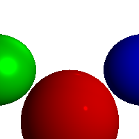

# raytracing

> Thanks to [Computer Graphics from scratch @ggambetta](https://www.gabrielgambetta.com/computer-graphics-from-scratch/introduction.html)

- code
- open [.ppm](https://github.com/tingwei628/raytracing/blob/master/assets/raytracing.ppm) with `xdg-open` on Linux
- demo

